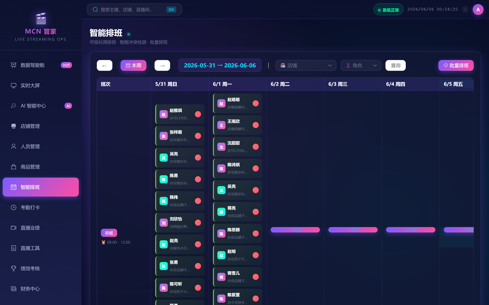
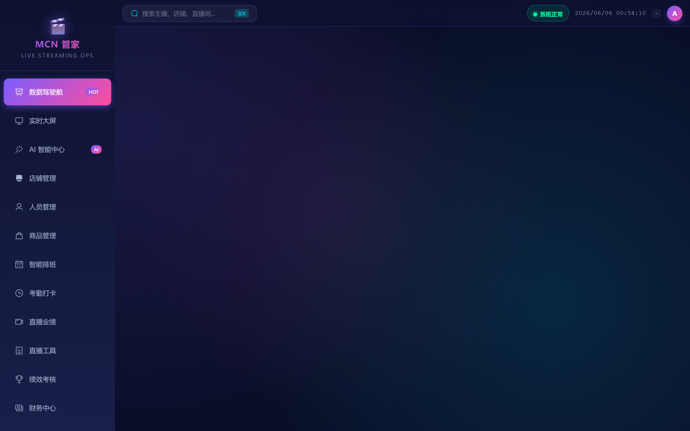
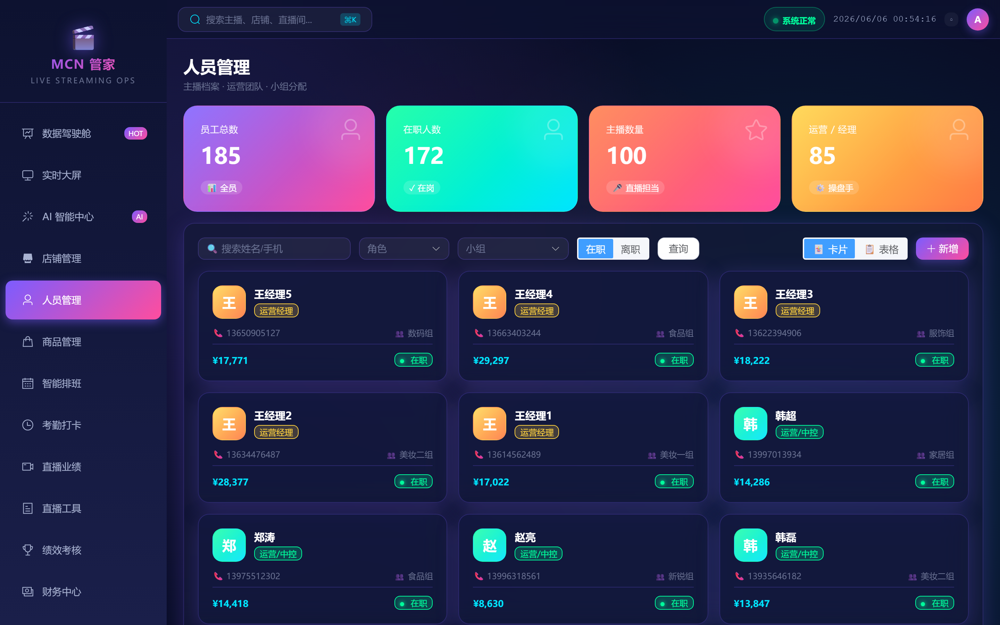
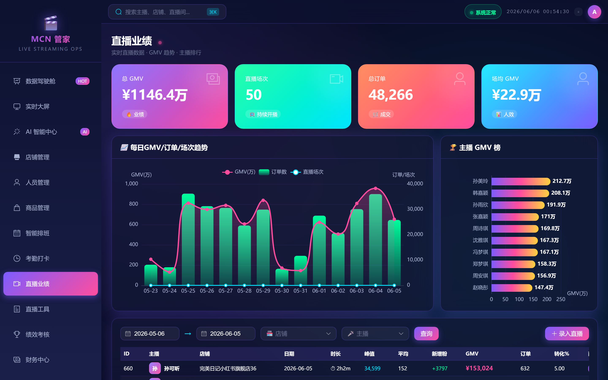
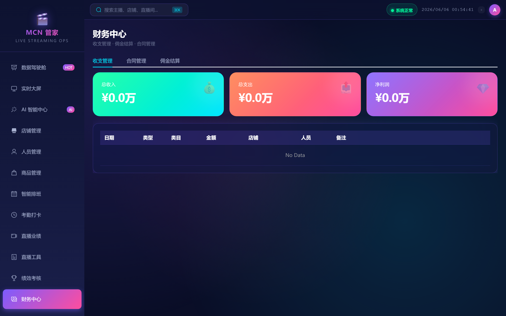
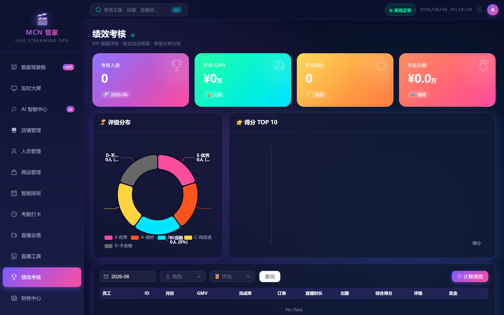
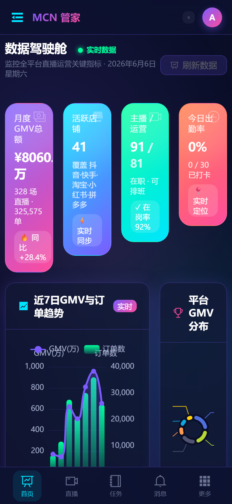
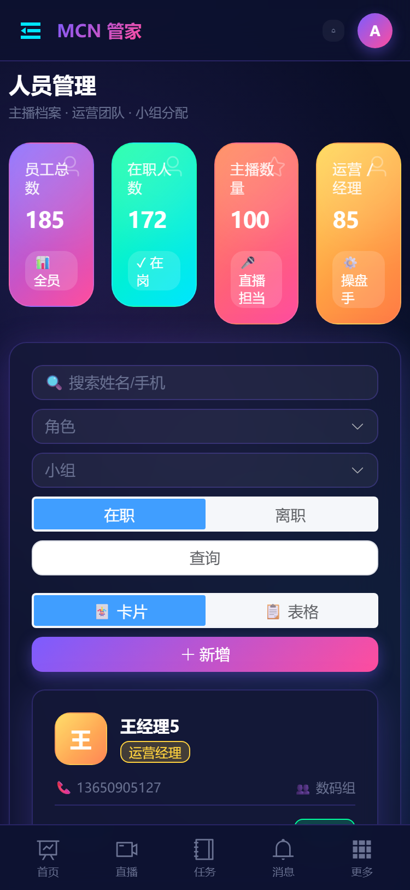
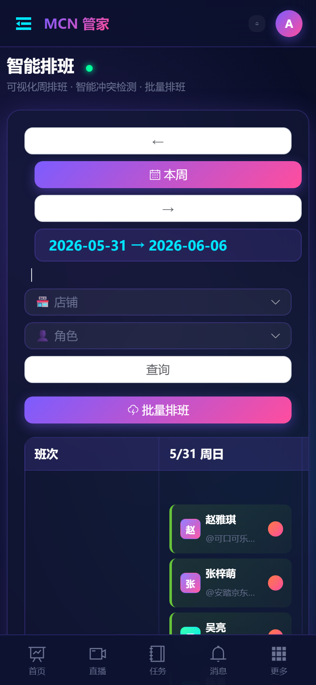

<div align="center">

# MCN Manager

### 🎬 Open-Source Live Streaming Commerce Management System

**A full-stack MCN management system covering the entire live streaming commerce value chain**

[English](#) · [中文文档](docs/README.md)

[](https://python.org)
[](https://djangoproject.com)
[](https://vuejs.org)
[](LICENSE)

[Screenshots](#-screenshots) · [Features](#-features) · [Quick Start](#-quick-start) · [Architecture](#-architecture) · [API Docs](docs/api.md) · [Deployment](docs/deployment.md) · [Contributing](CONTRIBUTING.md)

---

</div>

## 📸 Screenshots

### Desktop

| Dashboard | AI Center | Smart Scheduling | Store Management |
|-----------|-----------|-------------------|------------------|
|  |  |  |  |

| Employee Management | Live Sessions | Finance Center | Performance Review |
|---------------------|---------------|----------------|--------------------|
|  |  |  |  |

### Mobile Responsive

| Dashboard (Mobile) | Employees (Mobile) | Scheduling (Mobile) |
|---------------------|--------------------|---------------------|
|  |  |  |

> 📋 See all **60 pages** with screenshots: [Full Screenshot Gallery](docs/screenshots.md)

---

## ✨ Features

### 🧠 AI Engine (6 Capabilities)

| Feature | Description |
|---------|-------------|
| **GMV Prediction** | Linear regression + moving average + seasonal adjustment, predict 1-30 day GMV |
| **Smart Scheduling** | Greedy matching algorithm considering anchor performance, fatigue, and tardiness |
| **Anchor Profiling** | 5-dimension radar (sales/traffic/conversion/stability/growth) + AI insights |
| **Anomaly Detection** | Z-Score statistics + rule engine for automatic anomaly detection |
| **Operation Insights** | 25+ real-time alerts (store health, anchor fatigue, contract expiry, etc.) |
| **Smart Matching** | Anchor-store combination scoring to find the best partners |

> Pure algorithm engine, no external AI API required, works out of the box.

### 🏢 Core Business (8 Modules)

| Module | Page | Key Features |
|--------|------|-------------|
| Dashboard | Dashboard | 4-dimension stats / 7-day GMV trend / platform distribution / TOP8 anchors |
| Store Management | Stores | Multi-platform (Douyin/Kuaishou/Taobao/etc.) / GMV achievement rate / CRUD |
| Employee Management | Employees | Dual view (card+table) / Anchor profiles / Role filtering / Team management |
| Smart Scheduling | Schedules | Weekly grid view / Batch scheduling / Conflict detection |
| Attendance | Attendance | Auto late detection / Statistics / Late TOP5 / Leave approval |
| Live Sessions | Sessions | Daily GMV trend / Anchor ranking / Full CRUD |
| Performance Review | Reviews | S/A/B/C/D grading / Auto-calculation / Bonus |
| Shift Config | Shifts | Card view / 5 shift types / Custom time ranges |

### 🚀 Extended Features (72 Modules)

| Category | Modules |
|----------|---------|
| **Merchandising** | Product Management, Product Selection, Sample Management, Flash Sales, Coupons |
| **Operations** | Live Scripts, Script Tags, Live Interactions, Room Decoration, Stream Scenes, Stream Plans |
| **Marketing** | Ad Campaigns, Short Videos, Campaigns, Competitor Rooms, Traffic Analysis |
| **Community** | Fan Groups, User Personas, KOL Contacts, Gifts/Rewards |
| **Finance** | Finance Center, Revenue Sharing, Settlements, Tax Records, Expenses, Inventories |
| **HR & Legal** | Sign Contracts, Contract Ledger, Authorizations, Negotiations, Investments, Logistics |
| **Monitoring** | Stream Alerts, Compliance Review, Public Opinion, Data Warnings, Return Analysis |
| **Collaboration** | Task Board, Notifications, Knowledge Base, Customer Complaints, After-Sales, AB Testing |
| **Administration** | Roles & Permissions, Operation Logs, Data Reports, Data Export, Billboard |
| **Enterprise** | System Announcements, Permission Policies, Audit Logs, Data Backups, Health Monitoring |
| **DevOps** | Integration Config, Workflow Templates, Report Scheduler, Export Center, Deployment Records |
| **Security** | White Label, Multi-Tenant, License Management, Risk Assessment, Disaster Recovery, Compliance Audit |
| **Config** | System Config, Feature Flags, API Key Management, Notification Templates |

---

## 🛠 Architecture

```
┌──────────────────────────────────────────────────┐
│              Multi-Platform Frontend               │
│  Web (Vue 3 + Element Plus) · Mini Program (uni-app)  │
│  PWA · Android (Capacitor) · 130 Pages Total      │
├──────────────────────────────────────────────────┤
│                 Gateway Layer                      │
│        Vite Proxy · Waitress · Django WSGI        │
│        JWT Auth · Rate Limit 100/min · CORS       │
├──────────────────────────────────────────────────┤
│                 Service Layer                      │
│   Dashboard · Store · Employee · Schedule · ...   │
│        Cache Decorator · Auto Cache Invalidation  │
├──────────────────────────────────────────────────┤
│               AI Engine Layer                      │
│   GMV Predict · Smart Schedule · Anchor Profile   │
│   Anomaly Detect · Insights · Smart Match         │
├──────────────────────────────────────────────────┤
│                  Data Layer                        │
│   154 Models · 20+ Indexes · select_related       │
│   SQLite WAL · 64MB Cache · 256MB mmap            │
└──────────────────────────────────────────────────┘
```

| Layer | Tech | Notes |
|-------|------|-------|
| Frontend | Vue 3 + Element Plus | Composition API · Lazy loading |
| Charts | ECharts 6 | Tree-shaking (Bar/Line/Pie only) |
| State | Pinia | Global Dashboard cache · 30s client TTL |
| Router | Vue Router 4 | History mode · lazy loading · fade transition |
| Build | Vite 8 | Manual chunks (element-plus/echarts/vendor) |
| Backend | Django 6 + DRF | Service layer · JSON-only · 50 per page |
| Cache | LocMemCache → Redis | 10000 max entries · auto invalidation |
| Database | SQLite WAL → PostgreSQL | 64MB cache · 256MB mmap · 30s timeout |
| WSGI | Waitress | Windows-friendly · Production-ready |

---

## 🚀 Quick Start

### Prerequisites

- Python 3.12+
- Node.js 18+ / npm 9+

### Setup

```bash
# 1. Clone the repository
git clone https://github.com/CodingFervor/mcn-manager.git
cd mcn-manager

# 2. Backend
cd anchor_system
pip install -r requirements.txt
python manage.py migrate
python manage.py seed_data    # Optional: import sample data (20 brands / 50 stores / 100 anchors)
python manage.py runserver 8000

# 3. Frontend (new terminal)
cd frontend
npm install
npm run dev    # Visit http://127.0.0.1:5173
```

### Default Account

Seed data creates admin user: `admin` / `admin123`

### Docker Deployment (Planned)

```bash
docker-compose up -d
```

---

## 📊 Performance

| Metric | Value | Notes |
|--------|-------|-------|
| Dashboard API | 2ms | Cache hit |
| Store Overview | 2.5ms | Cache hit |
| AI Insights | 3ms | Cache hit (cold start ~500ms) |
| AI Schedule | 2.5ms | Cache hit (cold start ~240ms) |
| AI Predict | 6ms | Cold start |
| Frontend Build | ~2.7s | Vite + Tree-shaking |
| Health Check | 1ms | DB + Cache |

---

## 📁 Project Structure

```
mcn-manager/
├── anchor_system/              # Django Backend
│   ├── backend/
│   │   ├── settings.py         # Config (DB/Cache/Limit/Log)
│   │   ├── middleware.py        # Request timing + Health check
│   │   └── urls.py              # Root URL config
│   ├── scheduling/
│   │   ├── models.py            # Core models (14)
│   │   ├── models_extra.py      # Extended models (27)
│   │   ├── models_extra2.py     # Monitoring & ops (10)
│   │   ├── models_extra3.py     # Business features (10)
│   │   ├── models_extra4.py     # Advanced features (20)
│   │   ├── services.py          # Service business layer
│   │   ├── ai_engine.py         # AI Engine
│   │   ├── views.py             # Core views
│   │   ├── views_extra.py       # Extended views
│   │   ├── ai_views.py          # AI endpoints
│   │   ├── serializers.py       # Core serializers
│   │   └── serializers_extra.py # Extended serializers
│   ├── manage.py
│   └── requirements.txt
│
├── frontend/                   # Vue Frontend
│   ├── src/
│   │   ├── views/               # 60 pages
│   │   ├── components/          # Reusable components (StatCard/PageHeader/ChartWrap)
│   │   ├── composables/         # Hooks (useApi/useChart)
│   │   ├── stores/              # Pinia Store
│   │   ├── router/              # Route config
│   │   ├── api.js               # API modules (55+)
│   │   ├── echarts.js           # ECharts Tree-shaking
│   │   ├── style.css            # Dark neon design system
│   │   ├── main.js              # Entry point
│   │   └── App.vue              # Layout shell
│   ├── vite.config.js
│   └── package.json
│
├── docs/                        # Documentation
│   ├── architecture.md          # System architecture
│   ├── api.md                   # API reference
│   ├── models.md                # Data models
│   ├── ai-engine.md             # AI engine docs
│   ├── frontend.md              # Frontend docs
│   ├── deployment.md            # Deployment guide
│   └── screenshots/             # Screenshots
│
├── CONTRIBUTING.md              # Contributing guide
├── CHANGELOG.md                 # Changelog
├── LICENSE                      # MIT License
└── README.md                    # This file
```

---

## 📖 Documentation

| Document | Description |
|----------|-------------|
| [Screenshots](docs/screenshots.md) | All 60 pages with desktop + mobile screenshots |
| [Architecture](docs/architecture.md) | Layered architecture, tech stack, project structure |
| [Quick Start](#-quick-start) | Installation, configuration, launch |
| [API Reference](docs/api.md) | 90+ endpoints full reference |
| [Data Models](docs/models.md) | 83 model field definitions |
| [AI Engine](docs/ai-engine.md) | 6 algorithm principles and usage |
| [Frontend](docs/frontend.md) | 60 pages, design system, components |
| [Deployment](docs/deployment.md) | Production deploy, Nginx, PostgreSQL, Redis |
| [Contributing](CONTRIBUTING.md) | How to contribute |
| [Changelog](CHANGELOG.md) | Version history |

---

## 🤝 Contributing

Contributions are welcome! Please read the [Contributing Guide](CONTRIBUTING.md).

1. Fork this repository
2. Create a feature branch (`git checkout -b feature/amazing-feature`)
3. Commit your changes (`git commit -m 'Add amazing feature'`)
4. Push to the branch (`git push origin feature/amazing-feature`)
5. Submit a Pull Request

---

## 📄 License

[MIT License](LICENSE)

---

## 🙏 Acknowledgments

- [Django](https://www.djangoproject.com/) — Web framework
- [Vue.js](https://vuejs.org/) — Frontend framework
- [Element Plus](https://element-plus.org/) — UI component library
- [ECharts](https://echarts.apache.org/) — Data visualization
- [Waitress](https://docs.pylonsproject.org/projects/waitress/) — WSGI server

---

<div align="center">

**If this project helps you, please give it a ⭐ Star!**

</div>
